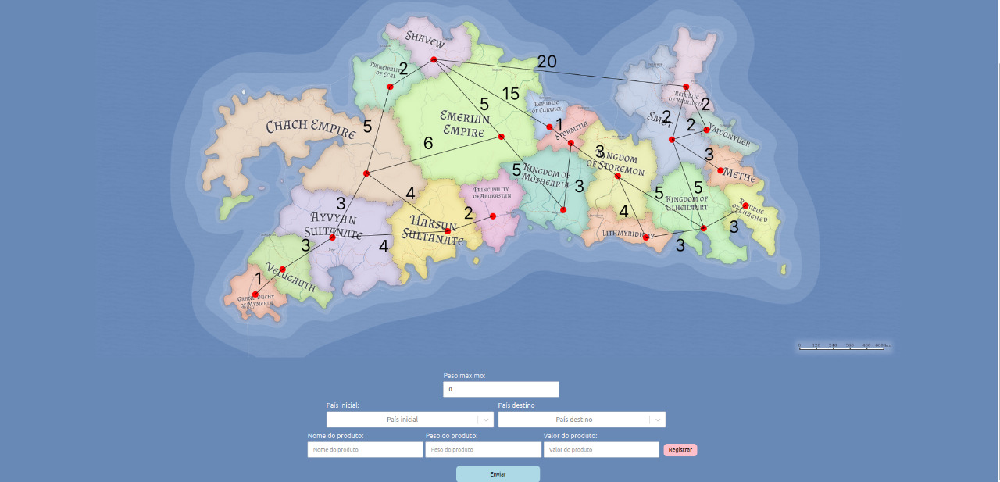
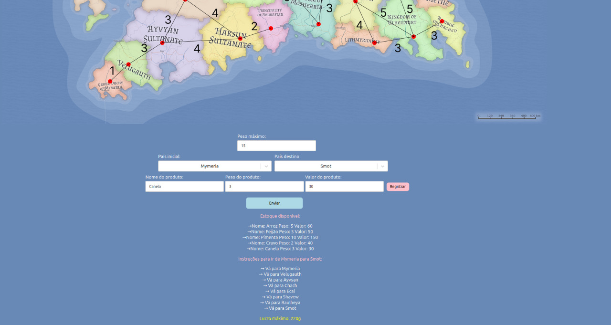
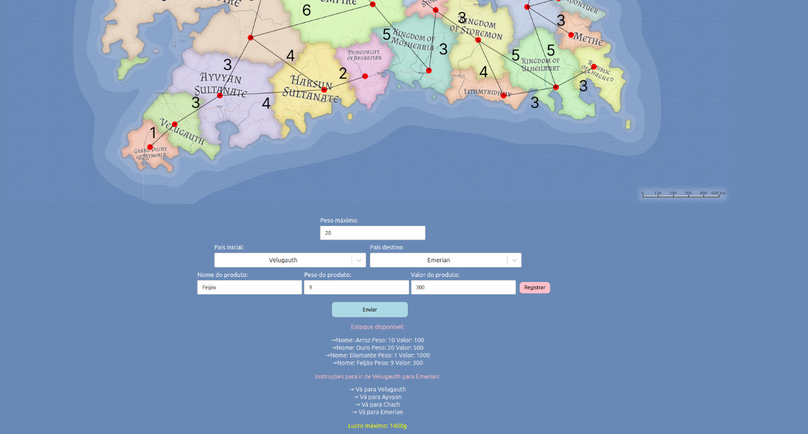

# Tema:
 - Trabalho Final

 

# Mapa do lucro

**Número da Lista**: 38<br>
**Conteúdo da Disciplina**: Trabalho Final<br>

## Alunos
|Matrícula | Aluno |
| -- | -- |
| 180042696  |  Magno Luiz Vale Vieira |
| 180127969  |  Matheus Yan Monteiro |

## Sobre 
Solução utilizando algoritmo Dijkstra para desvendar a rota mais vantajosa entre pontos do mapa fictício gerado.


## Screenshots


</figcaption>
    Imagem 1: Tela Inicial
</figcaption>


</figcaption>
    Imagem 2: Tela de Resultado 1
</figcaption>


</figcaption>
    Imagem 3: Tela de Resultado 2
</figcaption>

## Instalação 
**Linguagem**: python e javascript<br>
**Framework**: react js<br>

Um dos pré requisitos para rodar o projeto é ter o docker e o docker-compose instalados,além de possuir a versão Python 3+.

Para subir o docker deve-se rodar o comando na pasta back:
``` shell
$ docker-compose up --build
```

para subir o frontend basta executar os comandos dentro da pasta frontend:
``` shell
$ yarn
```
e
``` shell
$ yarn start
```

E assim acessar o endereço http://localhost:3000 no seu navegador.

Evite utilizar o Google Chrome. 

## Uso 
Escolha o país de origem e o país de destino e aperte o botão enviar. Feito isso, a api retornará o caminho mais otimizado entre os países selecionados.
